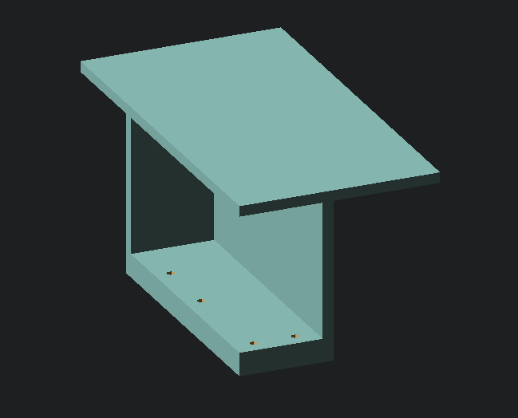

# Chair-Mounted Mini-Tables

Small tables that can attach to your chair for mounting split keyboards.
As seen in the [Trackswitch Manuform](https://github.com/rish987/trackswitch-manuform) hyper-ergonomic keyboard.

Why should you mount your keyboard to your chair?
- Allows for a much more natural shoulder angle while typing (i.e. your upper arms are straight down rather than extending outwards to reach a keyboard on a table)
- If you have an articulated chair, the keyboards are kept at the same position relative to your body while you are leaning back, swivelling, or adjusting the height.
- Free up your desk for other things!!!

# Build Guide

(Build guide coming soon!)

## License

Copyright © 2022-2023 Rishikesh Vaishnav

The source code for generating the models is distributed under the [GNU AFFERO GENERAL PUBLIC LICENSE Version 3](LICENSE).

The generated models are distributed under the [Creative Commons Attribution-ShareAlike 4.0 International (CC BY-SA 4.0)](LICENSE-models).
